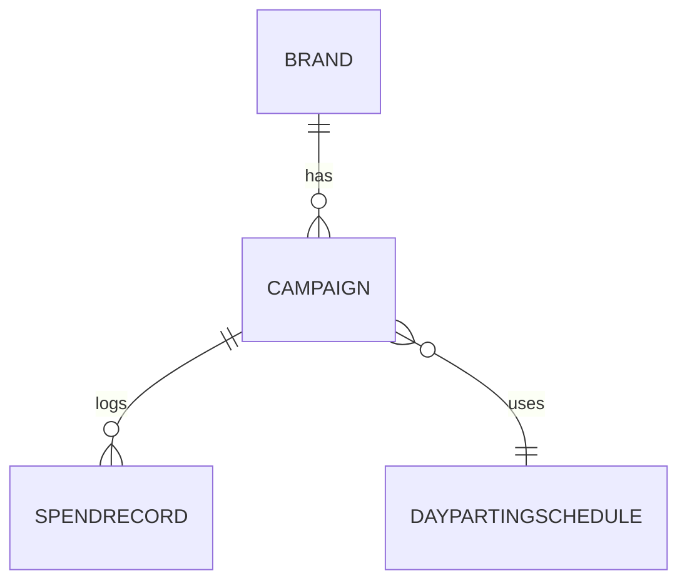
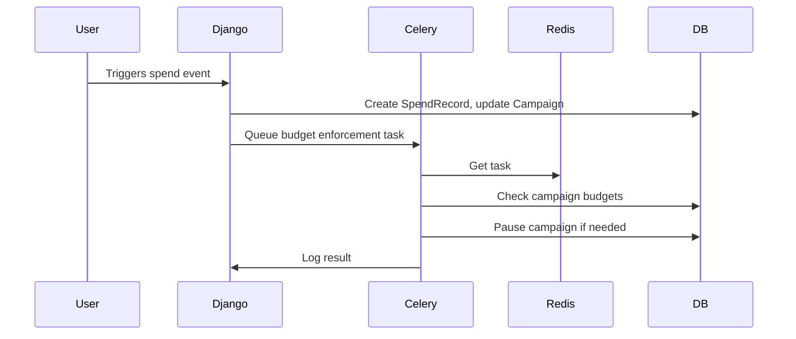

# ARCHITECTURE.md

## Introduction

This system manages advertising budgets for agencies. It tracks spend, enforces daily and monthly limits, and controls when campaigns run. It is used by operations, finance, and engineering teams who need reliable, automated budget control.

---

## Core Components

- **Django App (`ads/`)**: Defines data models, business logic, and admin interface.
- **Celery Workers**: Run background and scheduled tasks for spend tracking, resets, and dayparting.
- **Redis Broker**: Handles task queues and results for Celery.
- **Database**: Stores brands, campaigns, spend records, and schedules.
- **Admin Panel**: Lets users manage brands, campaigns, and schedules.

---

## Data Models

### Brand (core)
- `name`: Unique brand name
- `daily_budget`: Daily spend limit
- `monthly_budget`: Monthly spend limit

### Campaign (core)
- `brand`: ForeignKey to Brand
- `name`: Campaign name
- `daily_spend`: Amount spent today
- `monthly_spend`: Amount spent this month
- `is_active`: Whether the campaign is running
- `dayparting_schedule`: Optional FK to DaypartingSchedule
- `last_daily_reset`: Timestamp of last daily reset
- `last_monthly_reset`: Timestamp of last monthly reset
- `budget_check_frequency`: Optional custom check interval (minutes)

### SpendRecord (core)
- `campaign`: ForeignKey to Campaign
- `amount`: Amount spent in this event
- `before_spend`: Spend before this event
- `after_spend`: Spend after this event
- `timestamp`: When the spend happened
- `meta`: Metadata for audit/compliance

### DaypartingSchedule (optional)
- `start_time`: When campaign can start each day
- `end_time`: When campaign must stop each day
- `days_of_week`: List of allowed days (e.g., Mon-Fri)
- `description`: Optional notes

---

## Entity Relationship Diagram



---

## Core Workflows

### 1. Tracking Spend
What it does: Records each spend event, updates campaign totals, and logs the event for audit.

```text
On spend event for a campaign:
  - Lock campaign row for update (atomic)
  - Read current daily_spend and monthly_spend
  - Add spend amount to daily_spend and monthly_spend
  - Create a SpendRecord with before/after values and metadata
  - Save updated campaign
  - If new spend exceeds daily or monthly budget:
      - Mark campaign for enforcement (pause)
```

### 2. Budget Enforcement
What it does: Pauses campaigns that exceed their daily or monthly budgets.

```text
For each active campaign:
  - If daily_spend > daily_budget or monthly_spend > monthly_budget:
      - Set is_active = False
      - Log pause event (for audit)
  - Else:
      - Do nothing
# Idempotent: running this multiple times has the same effect
```

### 3. Dayparting Checks
What it does: Pauses campaigns outside allowed hours/days, reactivates them when allowed and under budget.

```text
For each campaign with a dayparting schedule:
  - If current time is not within allowed window or day:
      - Set is_active = False
      - Log pause event
  - Else if within allowed window and budgets not exceeded:
      - Set is_active = True
      - Log activation event
# Idempotent: safe to run repeatedly
```

### 4. Daily Reset
What it does: Resets daily spend counters and reactivates eligible campaigns at the start of each day.

```text
At start of each day:
  - For all campaigns:
      - If last_daily_reset is not today:
          - Set daily_spend = 0
          - Update last_daily_reset to today
          - If campaign is within allowed hours and under budget:
              - Set is_active = True
          - Log reset event
# Idempotent: safe to run multiple times per day
```

### 5. Monthly Reset
What it does: Resets monthly spend counters and reactivates eligible campaigns at the start of each month.

```text
At start of each month:
  - For all campaigns:
      - If last_monthly_reset is not this month:
          - Set monthly_spend = 0
          - Update last_monthly_reset to this month
          - If campaign is within allowed hours and under budget:
              - Set is_active = True
          - Log reset event
# Idempotent: safe to run multiple times per month
```

---

## Sequence Diagrams

### Spend Tracking Flow
Shows how a spend event is processed and budgets are enforced.



---

## Key Assumptions

- All times are in UTC.
- Celery Beat schedules all periodic tasks.
- All tasks are idempotent (safe to run multiple times).
- Configuration is via environment variables.
- Batch processing is used for efficiency.
- Only active campaigns are checked for enforcement.

---

## Design Decisions & Trade-offs

- **Celery + Redis**: Chosen for reliable, scalable background task processing. Other options were less mature or harder to deploy.
- **Static schedules**: Uses cron-like intervals for simplicity and reliability. Dynamic schedules could be added later.
- **Batch processing**: Improves performance for large numbers of campaigns.
- **Idempotency**: All resets and enforcement tasks are safe to run more than once.

---

## Future Improvements

- Dynamic (per-campaign) schedule support
- PostgreSQL for production deployments
- High-availability Redis
- Monitoring and alerting for tasks and budgets
- Multi-currency support

---

## References

- [README.md](./README.md) — Setup and usage
- [Django Documentation](https://docs.djangoproject.com/)
- [Celery Documentation](https://docs.celeryq.dev/)
- [Redis Documentation](https://redis.io/documentation) 